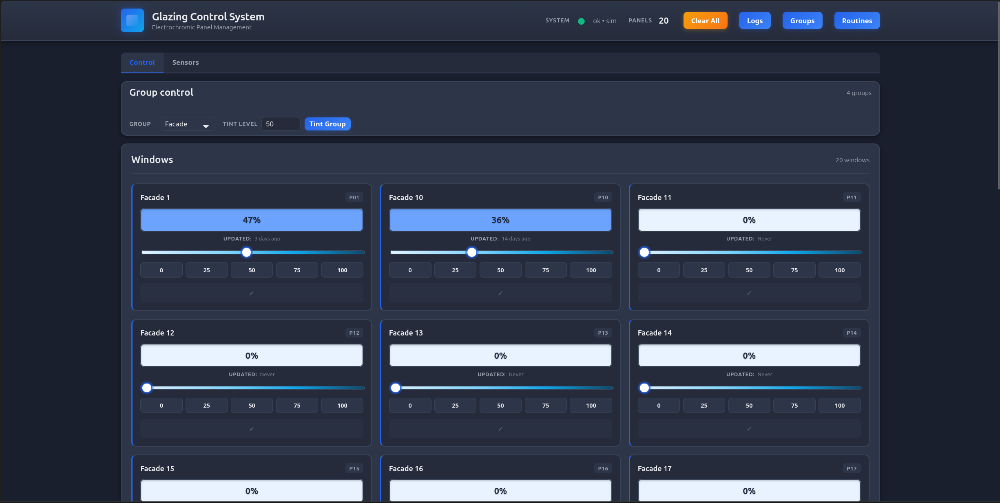
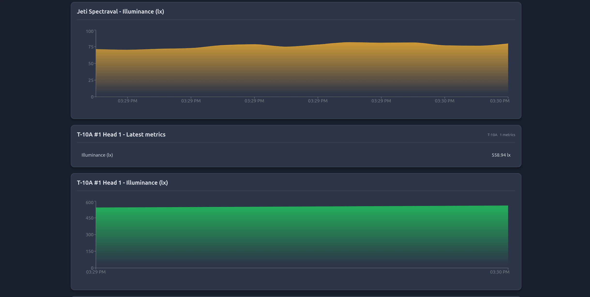

<div align="center">
  <h1>Glazing Control App</h1>
  <p><strong>A local-first control and scheduling system for the OSU Daylighting Innovation and Analysis Lab (DIAL) trailer.</strong></p>
</div>


*A sleek interface for visualizing and controlling electrochromic panels and skylights.*

## Overview

The **Glazing Control App** is the custom software backbone for the **[Daylighting Innovation and Analysis Lab (DIAL)](https://www.clotildepierson.com/facilities/dial)** at Oregon State University. DIAL is a state-of-the-art, off-grid capable mobile research facility designed to study the impact of daylighting on human health and productivity.

This app provides researchers and facility managers with a local-first system to intuitively manage, schedule, and monitor the facility's Halio electrochromic smart-glazing.

**The Problem:** Architectural researchers in DIAL need a reliable, study-friendly way to control two symmetrical test rooms (each with 9 windows and 1 skylight) without relying on external internet connections, especially when the mobile lab is deployed in remote or off-grid locations.

**The Solution:** By combining live status monitoring with an automated scheduling engine, this system provides precise environmental control—enabling seamless daylighting research, minimizing glare, and enhancing occupant comfort, all while operating entirely locally.

## Key Features

- **Local-First Reliability:** Operates entirely on the local trailer network, ensuring 100% uptime and responsiveness without depending on external internet access—perfect for off-grid deployments.
- **Smart Scheduling Engine:** Create study-friendly, automated routines that adjust pane tinting based on time of day, minimizing manual intervention during research experiments.
- **Live System Status:** Get real-time monitoring and visualization of all 18 Halio facade panels and 2 skylights from a single, unified dashboard.
- **Sensor Integration Ready:** Built to complement DIAL's advanced suite of indoor and rooftop environmental sensors (including JETI spectroradiometers and EKO pyranometers).
- **Safe Manual Override:** Need an immediate change? Easily take direct control of individual panels with our safety-first manual override protocols.


*DIAL's advanced sensor suite provides real-time environmental data to the control system.*

## How to Try It

To run the local control service and researcher UI on your machine:

**Prerequisites:**
- [Node.js](https://nodejs.org/) (v18+)
- [Docker](https://www.docker.com/) (Optional, for full stack environment)

**Getting Started:**

1. **Clone the repository:**
   ```bash
   git clone https://github.com/OSU-Radiant-Lab/GlazingControlApp.git
   cd GlazingControlApp
   ```

2. **Start the development servers:**
   Run the watcher from the root directory to spin up both the frontend UI and the backend control service:
   ```bash
   npm run watch -- both
   ```
   *(Alternatively, run `npm run watch -- frontend` or `npm run watch -- backend` to run them individually).*

3. **Access the Application:**
   Open your browser and navigate to `http://localhost:3000` (or the port specified in your console output) to view the researcher UI.

*Note: For real sensor deployment and site-specific facility notes, please refer to our [Setup Documentation](docs/real_sensor_setup.md).*

## The Team

This project was built by Team 76 for the OSU Radiant Lab. 

- **Aidan Lusk** - [luskai@oregonstate.edu](mailto:luskai@oregonstate.edu)
- **Carlos Vasquez** - [vasqueca@oregonstate.edu](mailto:vasqueca@oregonstate.edu)
- **Ian McKee** - [mckeei@oregonstate.edu](mailto:mckeei@oregonstate.edu)
- **Tyler Vincent** - [vincenty@oregonstate.edu](mailto:vincenty@oregonstate.edu)
- **Alexander Ulbrich** - [alexander.ulbrich@oregonstate.edu](mailto:alexander.ulbrich@oregonstate.edu)

**Feedback & Contributions:**
Please open an issue on GitHub or reach out to the team directly via email. For internal team communication, refer to Discord channel Team 76.

---
<div align="center">
  <p>Licensed under the <a href="LICENSE">GPL 3.0 License</a>.</p>
</div>
