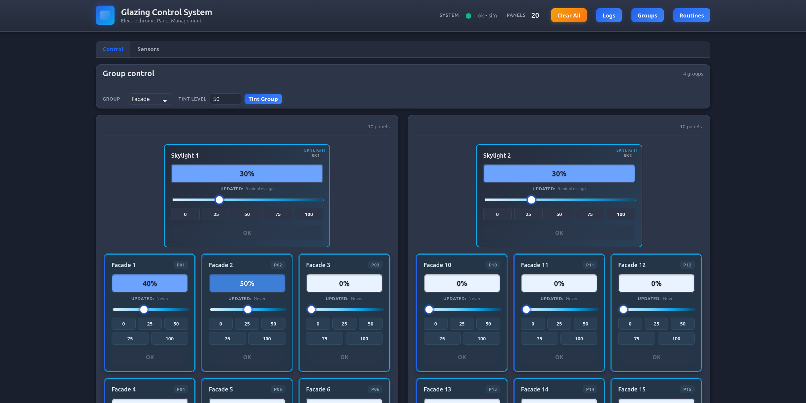
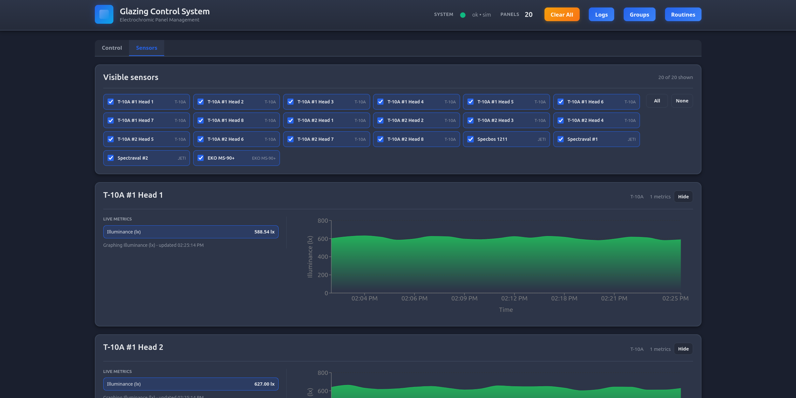

<div align="center">
  <h1>DIAL Control Center</h1>
  <p><strong>A local-first control and scheduling system for the OSU Daylighting Innovation and Analysis Lab (DIAL) trailer.</strong></p>
</div>


*A sleek interface for visualizing and controlling electrochromic panels and skylights.*

## Overview

The **DIAL Control Center** is the custom software backbone for the **[Daylighting Innovation and Analysis Lab (DIAL)](https://www.clotildepierson.com/facilities/dial)** at Oregon State University. DIAL is an off-the-grid mobile university research facility designed to study the impact of daylighting on human health and productivity.

This app provides researchers and facility managers with a local-first system to intuitively manage, schedule, and monitor the facility's Halio electrochromic glazing.

**The Problem:** Architectural researchers in DIAL need a reliable, study-friendly way to control two symmetrical test rooms (each with 9 windows and 1 skylight) without relying on external internet connections, especially when the mobile lab is deployed in remote or off-grid locations.

**The Solution:** By combining live status monitoring with an automated scheduling engine, the local software system provides precise environmental control.

## Key Features

- **Local-First Reliability:** Operates entirely on the local trailer network, provides responsiveness without depending on external internet access.
- **Smart Scheduling Engine:** Create study-friendly, automated routines that adjust pane tinting based on time of day, minimizing manual intervention during research experiments.
- **Live System Status:** Get real-time monitoring and visualization of all 18 Halio facade panels and 2 skylights from a single, unified dashboard.
- **Sensor Visualization:** Track live and historical sensor metrics, toggle sensor visibility, select specific metrics to graph, and view real-time spectral irradiance graphs.
- **Sensor Integration Ready:** Built to analyze and manage DIAL's advanced setup of indoor and rooftop environmental sensors (including JETI spectroradiometers and EKO pyranometers).
- **Safe Manual Override:** The safety-first manual override protocols allow the researchers to take direct control of individual panels.

<div align="center">
  
  <br>
  <em>Real-time sensor monitoring, visibility toggles, and live/historical spectral irradiance graphs.</em>
</div>

For a clean machine setup, use [`DEV-SETUP.md`](./DEV-SETUP.md). The backend expects Python `>=3.11,<3.14`; the frontend uses Node.js/NPM. EKO site deployments now use the C-BOX Ethernet Modbus TCP interface (`host` plus TCP `port` 502) and no longer use USB-to-RS485 or a COM port for EKO.

## How to Try It

**Prerequisites:**
- [Node.js](https://nodejs.org/) 20 or newer (CI and the Dockerfile use 20; `react-router` requires `>=20`)
- Python 3.11 to 3.13 (`svc/pyproject.toml` pins `>=3.11,<3.14`)
- [uv](https://docs.astral.sh/uv/)
- [Docker](https://www.docker.com/) or [Podman Desktop](https://podman-desktop.io/), only for the container path

**Getting Started:**

1. **Clone the repository:**
   ```bash
   git clone https://github.com/radiantlab/GlazingControlApp
   cd GlazingControlApp
   ```

2. **Run the app.** [`DEV-SETUP.md`](./DEV-SETUP.md) has the full procedure. In short:
   - Development: copy `svc/.env.example` to `svc/.env`, start the backend with `cd svc && uv sync && uv run python main.py` (API on `http://127.0.0.1:8000`), then the frontend with `cd web && npm ci && npm run dev` (HMI on `http://localhost:5173`).
   - Container: `podman compose -f docker-compose.development.yml up --build` serves the API and the built HMI together on `http://localhost:8000`.

3. **Watch for errors (optional):** `npm run watch` from the repository root runs `tsc --noEmit --watch` for the frontend and re-runs `uv run pytest -q` in `svc` whenever a backend Python or TOML file changes. It starts no servers. Pass `backend`, `frontend`, or `both` to pick a side (`npm run watch -- backend`); from inside `svc` or `web` it defaults to that side.

The API reference (Swagger UI) is at `/api/docs` on a running backend, for example `http://127.0.0.1:8000/api/docs`.

*Note: For production sensor deployment and site-specific facility notes, see the [production setup documentation](docs/production_sensor_setup.md).*

## Documentation

- [`OVERVIEW.md`](./OVERVIEW.md): architecture and file map.
- [`DEV-SETUP.md`](./DEV-SETUP.md): local development, containers, and production deployment.
- [`CONTRIBUTING.md`](./CONTRIBUTING.md): workflow, tests, and review rules.
- [`svc/README.md`](./svc/README.md): control service, environment variables, sensors, and operator notes.
- [`web/README.md`](./web/README.md): researcher HMI.
- [`docs/production_sensor_setup.md`](./docs/production_sensor_setup.md): production sensor setup.
- [`docs/on_site_sensor_checklist.md`](./docs/on_site_sensor_checklist.md): on-site sensor checklist.
- [`docs/glazing_configuration.md`](./docs/glazing_configuration.md): glazing configuration.
- [`docs/architectureDiagram.md`](./docs/architectureDiagram.md): architecture diagram.
- [`docs/simulator_implementation.md`](./docs/simulator_implementation.md): panel simulator.
- [`docs/jeti_lival_integration.md`](./docs/jeti_lival_integration.md): JETI LiVal integration.
- [`scripts/sensors/README.md`](./scripts/sensors/README.md): Windows Sensor Agent and sensor capture scripts.
- API reference: `/api/docs` (Swagger UI) and `/api/openapi.json` on a running backend.

## The Team

This project was built by Team 76 for the OSU Radiant Lab. 

- **Aidan Lusk** - [luskai@oregonstate.edu](mailto:luskai@oregonstate.edu)
- **Carlos Vasquez** - [vasqueca@oregonstate.edu](mailto:vasqueca@oregonstate.edu)
- **Ian McKee** - [mckeei@oregonstate.edu](mailto:mckeei@oregonstate.edu)
- **Tyler Vincent** - [vincenty@oregonstate.edu](mailto:vincenty@oregonstate.edu)

**Feedback & Contributions:**
Please open an issue on GitHub or reach out to the team directly via email. For internal team communication, refer to Discord channel Team 76.

---
<div align="center">
  <p>Licensed under the <a href="LICENSE">GPL 3.0 License</a>.</p>
</div>
