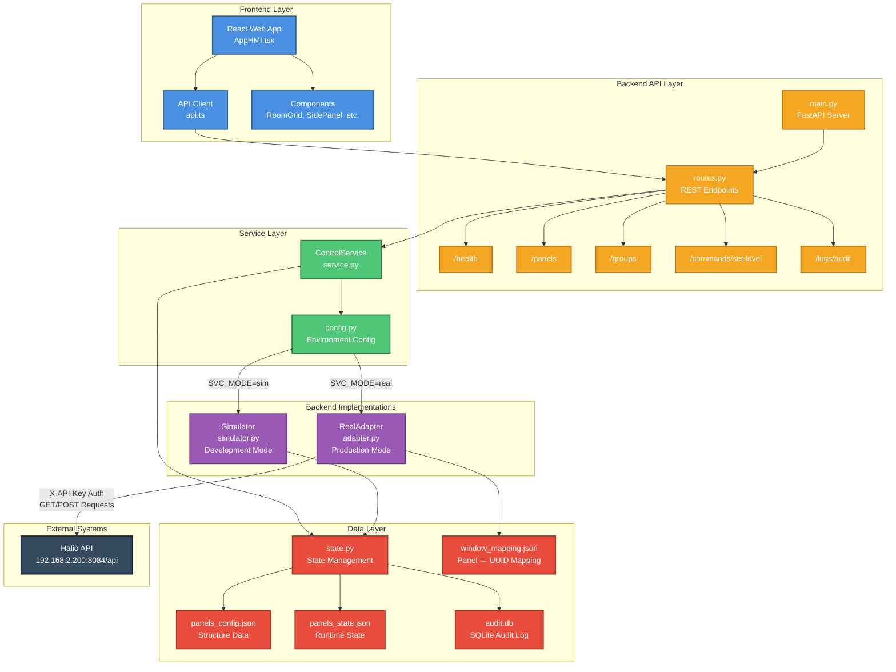

# High Level Architecture Diagram



## Component Flow

### Request Flow (Setting Panel Level)
```
User Action → React Component → API Client → FastAPI Route 
→ ControlService → Backend (Simulator Or RealAdapter) 
→ State Management → Data Files
```

### Mode Switching
- **Sim Mode**: `SVC_MODE=sim` → Uses `Simulator` → Reads/Writes local JSON files
- **Real Mode**: `SVC_MODE=real` → Uses `RealAdapter` → Makes HTTP requests to Halio API

### Data Flow
- **Config Data** (panels_config.json): Panel/Group structure, names, relationships
- **State Data** (panels_state.json): Current tint levels, timestamps
- **Audit Log** (audit.db): SQLite database storing all control actions with actor, timestamp, result
- **Window Mapping** (window_mapping.json): Maps panel IDs (P01, P02) to Halio UUIDs

## Key Design Decisions

1. **Service Layer Abstraction**: `ControlService` provides a stable interface regardless of backend
2. **Mode Switching**: Zero code changes needed when switching between sim/real modes
3. **State Separation**: Config (structure) vs State (runtime values) separated for clarity and ease of repo use
4. **Error Handling**: All layers handle errors gracefully, returning empty arrays/None on failure
5. **Audit Trail**: All control actions logged with actor, timestamp, and result

