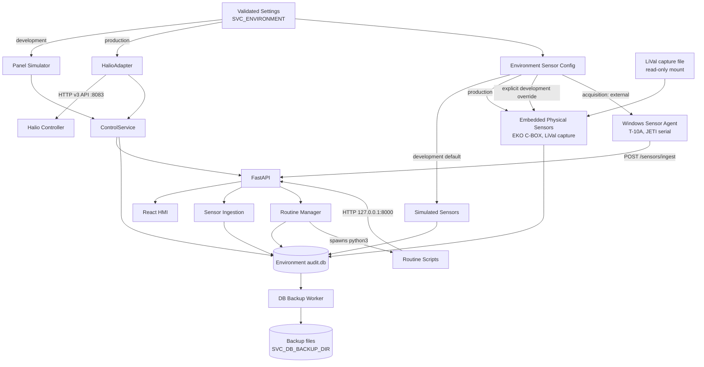

# Architecture

```mermaid
flowchart TD
    SETTINGS["Validated Settings<br/>SVC_ENVIRONMENT"]
    SETTINGS -->|development| DEV[Panel Simulator]
    SETTINGS -->|production| HALIO[HalioAdapter]
    HALIO -->|"HTTP v3 API :8083"| CONTROLLER[Halio Controller]
    DEV --> SERVICE[ControlService]
    HALIO --> SERVICE
    SERVICE --> API[FastAPI]
    API --> WEB[React HMI]

    SETTINGS --> SENSOR_CONFIG[Environment Sensor Config]
    SENSOR_CONFIG -->|development default| SIM_SENSORS[Simulated Sensors]
    SENSOR_CONFIG -->|production| PHYSICAL_SENSORS["Embedded Physical Sensors<br/>EKO C-BOX, LiVal capture"]
    SENSOR_CONFIG -->|explicit development override| PHYSICAL_SENSORS
    LIVAL["LiVal capture file<br/>read-only mount"] --> PHYSICAL_SENSORS

    SIM_SENSORS --> DB[(Environment audit.db)]
    PHYSICAL_SENSORS --> DB
    SERVICE --> DB
    DB --> BACKUP["DB Backup Worker"]
    BACKUP --> BACKUPS[("Backup files<br/>SVC_DB_BACKUP_DIR")]

    SENSOR_CONFIG -->|"acquisition: external"| AGENT["Windows Sensor Agent<br/>T-10A, JETI serial"]
    AGENT -->|"POST /sensors/ingest"| API
    API --> INGEST[Sensor Ingestion]
    INGEST --> DB

    API --> ROUTINE_MANAGER[Routine Manager]
    ROUTINE_MANAGER --> DB
    ROUTINE_MANAGER -->|"spawns python3"| ROUTINES[Routine Scripts]
    ROUTINES -->|"HTTP 127.0.0.1:8000"| API
```

## Environment boundary

- `development` uses the panel simulator and simulated sensors by default.
- `production` uses `HalioAdapter` and physical sensors only.
- Invalid or missing production configuration stops startup before database initialization.
- Development physical-device overrides are explicit and reported as
  `sensor_source: mixed`.
- Devices marked `"acquisition": "external"` are not opened by the service.
  The native Windows Sensor Agent reads them and posts to `POST /sensors/ingest`.

## Routines

The routine manager runs inside the service and stores routine records in the
database. Each routine runs as a separate `python3` subprocess that reaches the
service only over HTTP at `http://127.0.0.1:8000`, like any other API client.

## Storage boundary

Production retains `/app/svc/data/audit.db`, backed by an explicitly configured
host directory. Development Compose mounts a named volume at the same container
path. Configuration is mounted separately at `/app/svc/config` and is not
writable by runtime code.

In production Compose also mounts the active LiVal capture file read-only at
`/app/svc/sensor-input/specbos-lival.capture` and the backup directory at
`/app/db-backups`. When `SVC_DB_BACKUP_INTERVAL_HOURS` is greater than 0, the
backup worker writes a full copy of `audit.db` there at startup and then every
interval.

The SQLite database contains audit records, panel state, development groups,
sensor metadata/readings/spectra, and routines.
