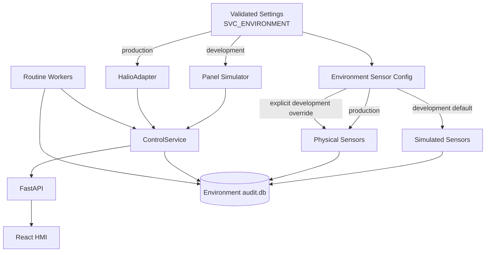

# Architecture

```mermaid
flowchart TD
    SETTINGS[Validated Settings<br/>SVC_ENVIRONMENT]
    SETTINGS -->|development| DEV[Panel Simulator]
    SETTINGS -->|production| HALIO[HalioAdapter]
    DEV --> SERVICE[ControlService]
    HALIO --> SERVICE
    SERVICE --> API[FastAPI]
    API --> WEB[React HMI]

    SETTINGS --> SENSOR_CONFIG[Environment Sensor Config]
    SENSOR_CONFIG -->|development default| SIM_SENSORS[Simulated Sensors]
    SENSOR_CONFIG -->|production| PHYSICAL_SENSORS[Physical Sensors]
    SENSOR_CONFIG -->|explicit development override| PHYSICAL_SENSORS

    SIM_SENSORS --> DB[(Environment audit.db)]
    PHYSICAL_SENSORS --> DB
    SERVICE --> DB
    ROUTINES[Routine Workers] --> SERVICE
    ROUTINES --> DB
```

## Environment boundary

- `development` uses the panel simulator and simulated sensors by default.
- `production` uses `HalioAdapter` and physical sensors only.
- Invalid or missing production configuration stops startup before database initialization.
- Development physical-device overrides are explicit and reported as
  `sensor_source: mixed`.

## Storage boundary

Production retains `/app/svc/data/audit.db`, backed by an explicitly configured
host directory. Development Compose mounts a named volume at the same container
path. Configuration is mounted separately at `/app/svc/config` and is not
writable by runtime code.

The SQLite database contains audit records, panel state, development groups,
sensor metadata/readings/spectra, and routines.
